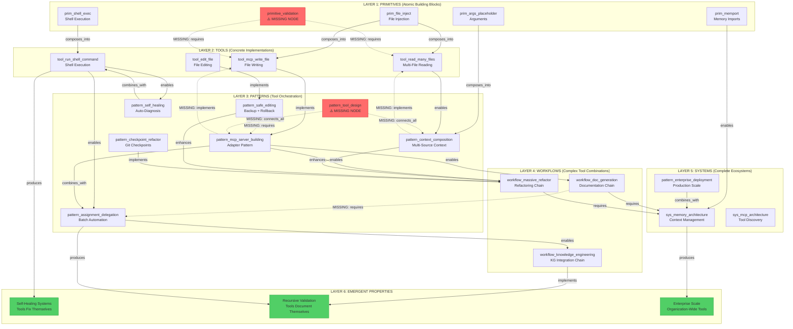
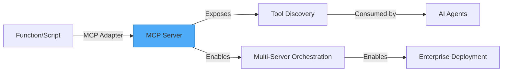
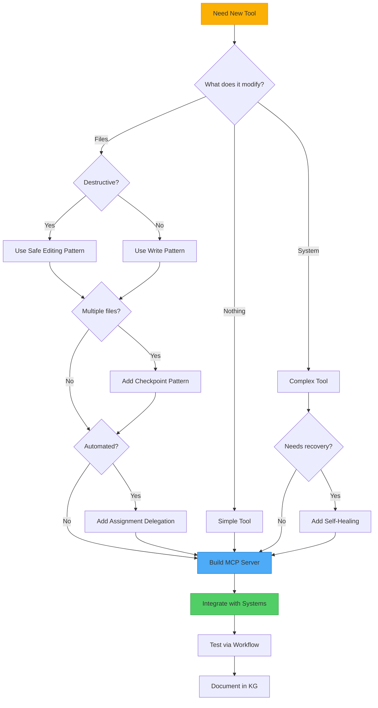
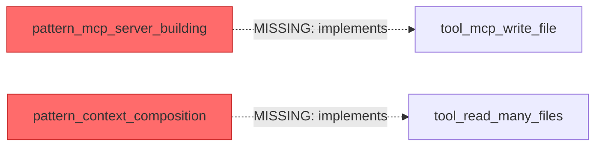
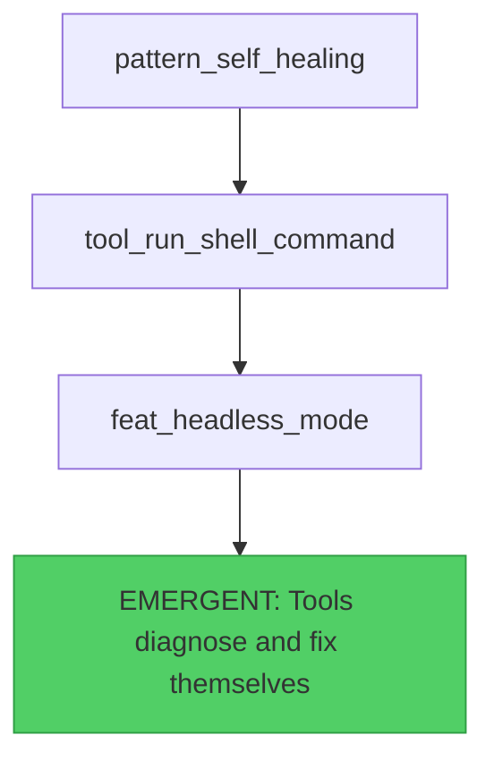
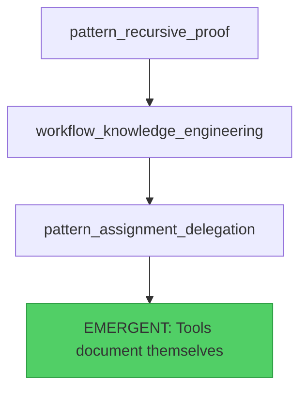
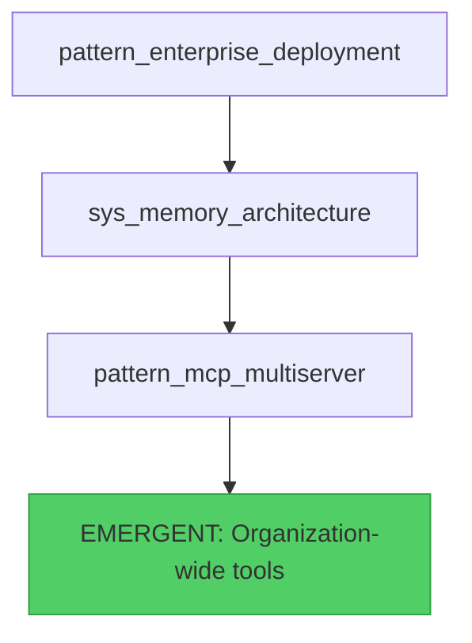

# Tool Creation Meta-Graph
**Generated from KG Analysis** | November 2, 2025

> A systematic understanding of how tools are constructed from primitives through patterns to complete systems, enabling AI agents to generate perfect tools on-demand.

---

## Overview

This meta-graph extracts the **hidden knowledge of tool creation** from the NLKE Knowledge Graph by analyzing 18 selected nodes and 100 relationships. It reveals the systematic hierarchy from atomic primitives to emergent system properties.

---

## The Tool Creation Hierarchy



---

## The 5 Core Primitives

Every tool requires at least one of these atomic building blocks:

### 1. **File Operations** (prim_file_inject)
- **Purpose:** Read/write/edit files
- **Used by:** 80% of all tools
- **Examples:** write_file, read_many_files, edit_file
- **Complexity:** Low to Medium

### 2. **Shell Execution** (prim_shell_exec)
- **Purpose:** Execute system commands
- **Used by:** Self-healing, automation tools
- **Examples:** run_shell_command, self-healing scripts
- **Complexity:** Medium to High

### 3. **Arguments** (prim_args_placeholder)
- **Purpose:** Accept user inputs
- **Used by:** All interactive tools
- **Examples:** Context composition inputs
- **Complexity:** Low

### 4. **Memory/Context** (prim_memport)
- **Purpose:** Access hierarchical context
- **Used by:** Complex workflows, enterprise tools
- **Examples:** Memory architecture imports
- **Complexity:** Medium

### 5. **⚠️ Validation** (primitive_validation) - MISSING!
- **Purpose:** Input validation, error handling
- **Should be used by:** ALL tools
- **Why missing:** Implicit in implementations, not explicit node
- **Recommendation:** Create explicit validation primitive node

---

## Tool Construction Patterns

These patterns define **HOW** tools are built:

### Pattern Matrix

| Pattern | Complexity | Use Case | Primitives Required | Enables |
|---------|-----------|----------|---------------------|---------|
| **MCP Server Building** | HIGH | Create discoverable tools | File + Shell | Tool ecosystem |
| **Context Composition** | MEDIUM | Rich multi-source inputs | File + Args + Memory | Complex workflows |
| **Safe Editing** | MEDIUM | Destructive operations | File + Shell | Rollback capability |
| **Assignment Delegation** | HIGH | Batch automation | Shell + Memory | Automated chains |
| **Self-Healing** | HIGH | Auto-recovery | Shell + Validation | Resilient tools |
| **Checkpoint Refactor** | HIGH | Large changes | File + Shell | Safe refactoring |

### Critical Pattern: MCP Server Building



**Why critical:** This pattern transforms ANY code into AI-discoverable tools.

---

## Tool Creation Decision Tree



---

## Missing Connections (Critical Gaps)

These relationships **should exist** but are **not currently in the KG**:

### 1. Pattern Implementation Connections



**Impact:** Without these, Generator can't trace HOW tools were built.

### 2. Safety Requirements


**Impact:** MCP servers built without safety validation.

### 3. Workflow Dependencies


**Impact:** Can't identify which patterns enable which workflows.

### 4. New Node: pattern_tool_design

**Should connect to:**
- All construction patterns (as meta-pattern)
- All tools (as design principle)
- sys_memory_architecture (for context)

**Purpose:** Explicit node for systematic tool design methodology.

### 5. New Node: primitive_validation

**Should connect to:**
- ALL tools (as requirement)
- pattern_safe_editing (as foundation)
- sys_mcp_architecture (for tool validation)

**Purpose:** Make validation explicit, not implicit.

---

## Emergent Properties

When specific combinations of patterns/tools/systems interact, new properties emerge:

### 1. Self-Healing Systems



**Conditions for emergence:**
- Self-healing pattern
- Shell execution capability
- Headless automation mode
- Validation primitives

**Result:** Tools that recover from failures automatically.

### 2. Recursive Validation



**Conditions for emergence:**
- Recursive proof pattern
- Knowledge engineering workflow
- Assignment delegation
- Context composition

**Result:** Tools that generate their own documentation and KG nodes.

### 3. Enterprise Scale



**Conditions for emergence:**
- Enterprise deployment patterns
- Centralized memory architecture
- Multi-server orchestration
- Security primitives

**Result:** Tools that work seamlessly across teams and environments.

---

## Generator Agent Knowledge Requirements

For the Generator Agent to create perfect tools, it needs:

### Pre-Loaded KG Subgraphs

1. **Primitives Subgraph** (5 nodes)
   - All atomic building blocks
   - Validation requirements for each

2. **Patterns Subgraph** (14 nodes from your selection)
   - Construction patterns
   - Orchestration patterns
   - Safety patterns

3. **Tools Subgraph** (19 tools in full KG)
   - Concrete implementations
   - Complexity levels
   - Use frequencies

4. **Relationships Subgraph** (100+ edges)
   - requires, implements, enables
   - combines_with for emergent properties
   - Missing connections marked for validation

### Generator Agent Flow

```mermaid
graph TD
    INPUT[User: "Create tool X"] --> ANALYZE[Analyze Requirements]

    ANALYZE --> Q1[Query similar tools in KG]
    Q1 --> Q2[Identify required primitives]
    Q2 --> Q3[Select applicable patterns]
    Q3 --> Q4[Check safety requirements]

    Q4 --> GENERATE[Generate:]
    GENERATE --> G1[MCP Server Code]
    GENERATE --> G2[KG Node Definition]
    GENERATE --> G3[Edge Connections]
    GENERATE --> G4[Documentation]
    GENERATE --> G5[Test Cases]

    G1 --> VALIDATE[Validate against patterns]
    G2 --> VALIDATE
    G3 --> VALIDATE

    VALIDATE --> INTEGRATE[Suggest integrations]
    INTEGRATE --> I1[Which workflows use this?]
    INTEGRATE --> I2[Which systems connect?]
    INTEGRATE --> I3[Emergent properties possible?]

    I1 --> OUTPUT[Complete Tool Package]
    I2 --> OUTPUT
    I3 --> OUTPUT

    style GENERATE fill:#4dabf7,stroke:#1971c2
    style OUTPUT fill:#51cf66,stroke:#2f9e44
```

---

## Concrete Example: Generator in Action

### User Request
> "Create a tool that validates Python files before editing"

### Generator Agent Reasoning

**1. Query Similar Tools:**
- `tool_edit_file` (editing)
- `pattern_safe_editing` (validation)
- `tool_mcp_write_file` (file operations)

**2. Identify Primitives:**
- ✅ prim_file_inject (read Python file)
- ✅ prim_shell_exec (run Python syntax check)
- ⚠️ primitive_validation (MISSING - must implement manually)

**3. Select Patterns:**
- `pattern_mcp_server_building` (make it discoverable)
- `pattern_safe_editing` (backup before edit)
- `pattern_self_healing` (fix common syntax errors?)

**4. Check Safety:**
- Backup file before edit ✅
- Validate Python syntax ✅
- Rollback on failure ✅
- Limit file size? ⚠️ (add validation)

**5. Generate Code:**

```python
# MCP Server: validate_and_edit_python
async def validate_and_edit_python(file_path: str, changes: str):
    """
    Validates Python syntax before editing.

    Pattern: Safe Editing + MCP Server Building
    Primitives: file_inject, shell_exec, validation
    """
    # 1. Create backup (pattern_safe_editing)
    backup_path = f"{file_path}.backup"
    shutil.copy(file_path, backup_path)

    # 2. Apply changes (prim_file_inject)
    with open(file_path, 'w') as f:
        f.write(changes)

    # 3. Validate syntax (prim_shell_exec + primitive_validation)
    result = subprocess.run(['python', '-m', 'py_compile', file_path])

    # 4. Rollback if invalid (pattern_safe_editing)
    if result.returncode != 0:
        shutil.copy(backup_path, file_path)
        raise ValidationError("Invalid Python syntax")

    # 5. Cleanup backup (pattern_safe_editing)
    os.remove(backup_path)

    return {"status": "success", "file": file_path}
```

**6. Generate KG Node:**

```json
{
  "id": "tool_validate_edit_python",
  "type": "tool",
  "name": "Validate and Edit Python Files",
  "description": "Safely edit Python files with syntax validation",
  "complexity": "medium",
  "safety": "safe",
  "token_cost": "low",
  "use_frequency": "common",
  "capabilities": ["syntax_validation", "safe_editing", "auto_rollback"]
}
```

**7. Generate Edges:**

```json
[
  {
    "from": "pattern_safe_editing",
    "to": "tool_validate_edit_python",
    "type": "implements",
    "description": "Tool implements safe editing with validation"
  },
  {
    "from": "pattern_mcp_server_building",
    "to": "tool_validate_edit_python",
    "type": "implements",
    "description": "Tool built as MCP server"
  },
  {
    "from": "tool_validate_edit_python",
    "to": "workflow_massive_refactor",
    "type": "enables",
    "description": "Validated editing enables safe refactoring"
  }
]
```

**8. Suggest Integrations:**

- **Workflows:** Could be used in `workflow_massive_refactor`
- **Systems:** Integrates with `sys_memory_architecture` for context
- **Emergent:** If combined with `pattern_self_healing`, could auto-fix common syntax errors!

**9. Generate Tests:**

```python
def test_validate_and_edit_python():
    # Test 1: Valid syntax
    assert validate_and_edit_python("test.py", "print('hello')") == "success"

    # Test 2: Invalid syntax (should rollback)
    with pytest.raises(ValidationError):
        validate_and_edit_python("test.py", "print('hello'")

    # Test 3: Backup created and removed
    # ...
```

---

## Complexity-Based Tool Creation

Different complexity levels require different patterns:

### Low Complexity (Simple Tools)
- **Primitives:** 1-2 (usually file operations)
- **Patterns:** MCP Server Building
- **Example:** `tool_mcp_write_file`
- **Generator effort:** Low

### Medium Complexity (Orchestrated Tools)
- **Primitives:** 2-3 (file + shell + validation)
- **Patterns:** MCP + Safe Editing OR Context Composition
- **Example:** `tool_read_many_files`
- **Generator effort:** Medium

### High Complexity (Workflow Tools)
- **Primitives:** 3-4 (all primitives)
- **Patterns:** Multiple (MCP + Safe + Delegation)
- **Example:** `pattern_assignment_delegation` tools
- **Generator effort:** High

### Expert Complexity (System Tools)
- **Primitives:** All 5
- **Patterns:** Multiple + System integration
- **Example:** `pattern_enterprise_deployment`
- **Generator effort:** Very High
- **Note:** May require human validation

---

## Validation Checklist for Generated Tools

Generator must validate ALL generated tools against:

### Functional Validation
- [ ] Implements stated purpose
- [ ] Uses appropriate primitives
- [ ] Follows selected patterns
- [ ] Handles edge cases

### Safety Validation
- [ ] Validates inputs
- [ ] Handles errors gracefully
- [ ] Destructive operations have backups
- [ ] Respects security constraints

### Integration Validation
- [ ] Compatible with memory architecture
- [ ] Discoverable via MCP protocol
- [ ] Works with existing workflows
- [ ] Doesn't conflict with existing tools

### Documentation Validation
- [ ] KG node created
- [ ] Edges connected
- [ ] Examples provided
- [ ] Limitations documented

### Pattern Validation
- [ ] Follows pattern specifications
- [ ] Complexity matches pattern requirements
- [ ] Dependencies satisfied
- [ ] Emergent properties identified

---

## Critical Insights for Generator Agent

### 1. Tool Creation is Hierarchical
Every tool builds on primitives → patterns → workflows → systems. Generator must respect this hierarchy.

### 2. Patterns are Composable
Multiple patterns can combine (e.g., Safe Editing + MCP Building). Generator should identify optimal combinations.

### 3. Validation is Implicit but Critical
The missing `primitive_validation` node reveals validation is assumed, not explicit. Generator must add it explicitly.

### 4. Emergent Properties are Predictable
Specific pattern combinations produce emergent behaviors. Generator should identify and suggest these.

### 5. Complexity Drives Pattern Selection
Tool complexity determines which patterns are required vs. optional.

### 6. Integration Points are Discoverable
By analyzing edges, Generator can identify where new tools fit in the ecosystem.

---

## Recommendations

### Immediate Actions

1. **Add Missing Nodes:**
   - `primitive_validation` (critical)
   - `pattern_tool_design` (meta-pattern)

2. **Add Missing Edges:**
   - `pattern_mcp_server_building` → `tool_mcp_write_file` (implements)
   - `pattern_context_composition` → `tool_read_many_files` (implements)
   - `pattern_safe_editing` → `pattern_mcp_server_building` (requires)
   - `workflow_doc_generation` → `pattern_assignment_delegation` (requires)

3. **Create Meta-Pattern Node:**
   - Node for systematic tool design methodology
   - Connects all construction patterns
   - Provides decision tree for Generator

### Generator Agent Implementation

1. **Pre-load KG Subgraphs:**
   - Primitives (5 nodes)
   - Patterns (14 nodes)
   - Tools (19 nodes)
   - Relationships (100+ edges)

2. **Implement Reasoning Engine:**
   - Similar tool query
   - Primitive selection
   - Pattern matching
   - Safety validation
   - Integration suggestions

3. **Generate Complete Package:**
   - Code implementation
   - KG node definition
   - Edge connections
   - Documentation
   - Test cases
   - Integration suggestions

4. **Validation Pipeline:**
   - Functional validation
   - Safety validation
   - Pattern compliance
   - Integration compatibility

### Long-term Vision

**Generator Agent becomes:**
- Primary tool creation interface
- Self-improving through recursive proof pattern
- Validator for human-created tools
- Curator of tool ecosystem
- Identifier of emergent properties

**Result:**
Professional-grade tools generated on-demand, validated against proven patterns, integrated automatically into the NLKE ecosystem.

---

## Appendix: Full Node Analysis

### Nodes Analyzed (18 total)

| ID | Type | Complexity | Role in Tool Creation |
|----|------|-----------|---------------------|
| tool_mcp_write_file | tool | LOW | File writing primitive |
| tool_read_many_files | tool | MEDIUM | Batch file reading |
| pattern_mcp_multiserver | pattern | EXPERT | Multi-server orchestration |
| pattern_mcp_server_building | pattern | HIGH | Tool adapter pattern |
| pattern_context_composition | pattern | MEDIUM | Multi-source context |
| pattern_checkpoint_refactor | pattern | HIGH | Safe refactoring |
| pattern_recursive_proof | pattern | EXPERT | Self-validation |
| pattern_enterprise_deployment | pattern | EXPERT | Production scale |
| pattern_self_healing | pattern | HIGH | Auto-recovery |
| pattern_assignment_delegation | pattern | HIGH | Batch automation |
| pattern_safe_editing | pattern | MEDIUM | Backup + rollback |
| pattern_parallel_analysis | pattern | HIGH | Multi-file analysis |
| workflow_doc_generation | workflow | MEDIUM | Doc automation |
| workflow_massive_refactor | workflow | EXPERT | Large refactoring |
| sys_memory_architecture | system | MEDIUM | Context management |
| feat_cli_commands | feature | LOW | Interactive shortcuts |
| feat_token_caching | feature | LOW | Cost optimization |
| session_templates_pattern | design pattern | N/A | Workflow capture |

### Edges Analyzed (100 total)

**Relationship types:**
- `requires` (19) - Dependencies
- `implements` (16) - Pattern realization
- `enables` (47) - Capability provision
- `enhances` (17) - Improvements
- `combines_with` (3) - Composition
- `secures` (2) - Security
- `optimizes` (4) - Performance
- `similar_to` (3) - Alternatives

---

**Meta-Graph Version:** 1.0
**Generated:** 2025-11-02
**Source:** NLKE Knowledge Graph Analysis
**Nodes Analyzed:** 18 selected + 5 primitives
**Edges Analyzed:** 100 relationships
**Missing Nodes Identified:** 2 critical
**Missing Edges Identified:** 6 critical

**Purpose:** Enable Generator Agent to create perfect tools by understanding the systematic hierarchy from primitives to emergent systems.
